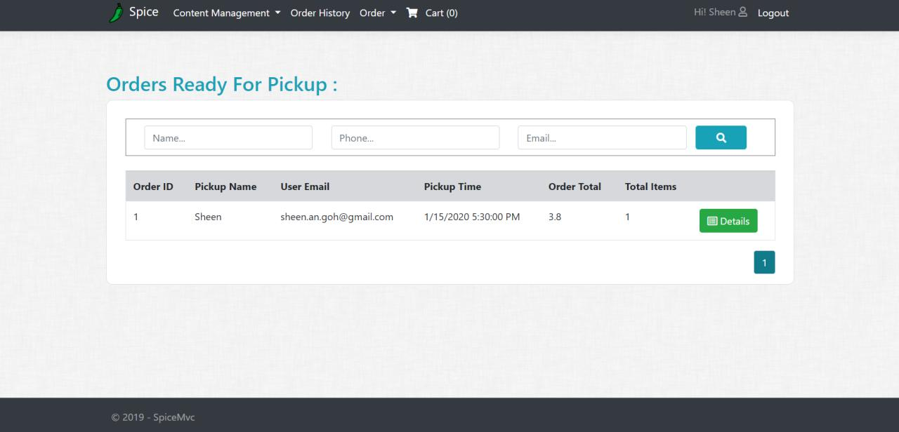
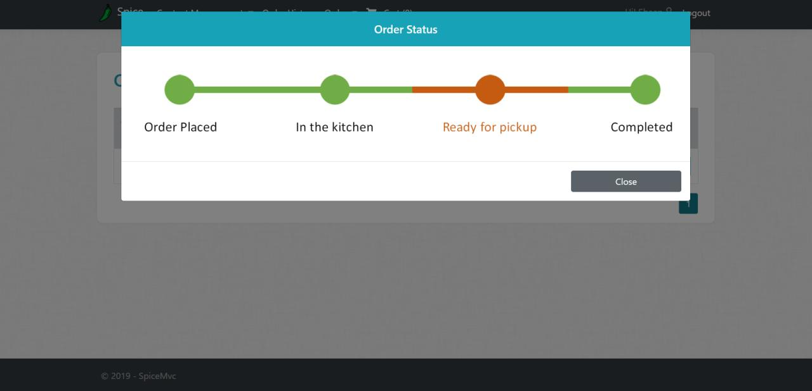
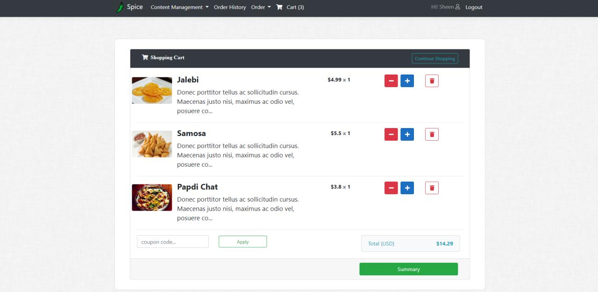
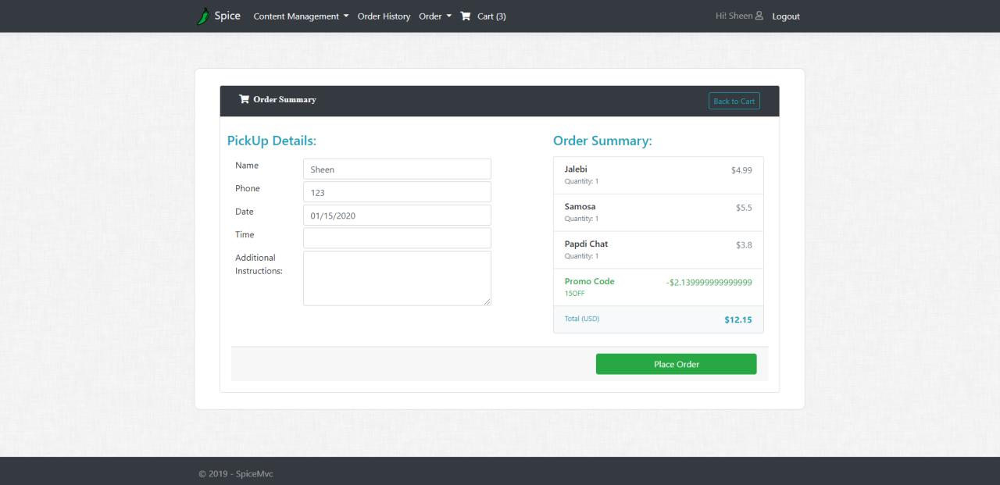
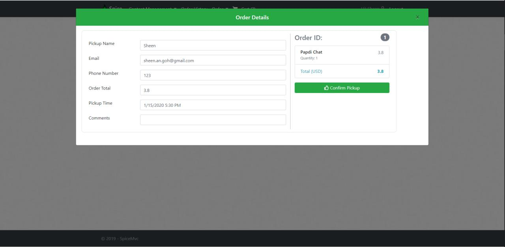

# Project Title - Spice MVC

A Project that is built using ASP.NET CORE.

This is an example af an ASP.NET CORE 3.0 application, following the tutorial of Bhrugen Patel.

## How to run the project

- Have  Visual Studio 2019 installed
- Before running the project, ensure the nuget packages are restored
- Run the project with F5 (Ensure Migration is completed, can use EF commands : Update-Database)

### Live-Preview

Visit this link (https://spicemvc20191219040938.azurewebsites.net/) for a live preview of the application.